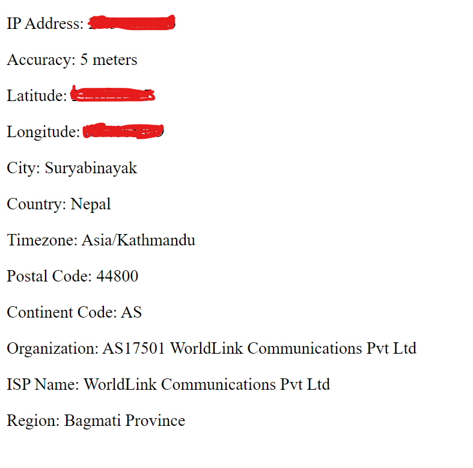

# Geo IP Reverse

Geo IP Reverse is a simple web application that retrieves geolocation details from IP addresses using reverse geocoding. It finds the real latitude and longitude with good accuracy.

## Demo Image



## Features

- **Reverse Geocoding**: Utilizes the OpenStreetMap Nominatim API to perform reverse geocoding, fetching detailed address information based on latitude and longitude coordinates.
- **IP-based Geolocation**: Fetches IP-based geolocation data using the GeoJS API, providing fallback information if accurate coordinates cannot be obtained.
- **Combining Data**: Merges IP-based and accurate geolocation data to provide comprehensive location information, including IP address, accuracy, latitude, longitude, city, country, timezone, and postal code.
- **Display**: Renders the combined location data directly in the browser, enhancing user experience by providing immediate feedback.

1. Clone the repository to your local machine:

   ```bash
   git clone https://github.com/your-username/geo-ip-reverse.git
   ```

2. Open the index.html file in your preferred web browser.

3. Allow the browser to access your location when prompted.

4. View the retrieved geolocation details displayed on the webpage.

## Technology Used

- **HTML**: Used for structuring the web page content.
- **JavaScript**: Implemented to fetch and manipulate data, as well as interact with APIs.
- **OpenStreetMap Nominatim API**: Utilized for reverse geocoding to obtain detailed address information.
- **GeoJS API**: Used for fetching IP-based geolocation data.

## Contribute

Feel free to contritbute the project.
